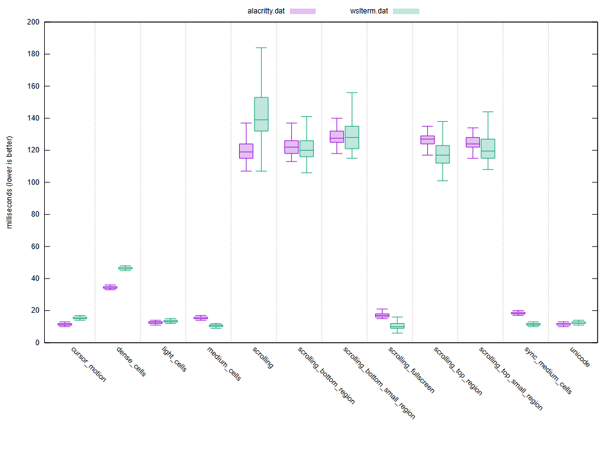

# WSL Terminal

A fast, native Windows terminal for WSL, written in Rust. It runs a **real Linux
PTY** in your WSL distro and renders it on the GPU with true per-pixel
transparency and color emoji.

## About

WSL Terminal opens a genuine `forkpty()` Linux terminal (not a `wsl.exe`/conhost
stdio bridge) and draws it in a borderless, translucent Windows window. It
supports tabs, split panes, a file sidebar, scrollback, and opens files in your
editor of choice.

Requirements: Windows 10/11 with WSL2 and the **Ubuntu** distro. (The target
distro is currently the compile-time constant `DISTRO` in `rust/wslterm/src/main.rs`.)

### Architecture

A Rust workspace under `rust/` plus two small C helpers under `native/`:

| crate / dir | role |
|---|---|
| `wslterm-core` | Portable VT engine — ANSI/VT parser, screen grid, scrollback. No OS deps; unit-tested. |
| `wslterm-pty` | Windows ↔ WSL transport — the vsock client, the `wslptyd` multiplex protocol, and bootstrap. |
| `wslterm` | The GUI binary (`wslterm.exe`) — `winit` window, GPU renderer, tabs/panes/sidebar, settings. |
| `native/wslptyd.c` | In-VM PTY **server**: `forkpty()`s one PTY per session and multiplexes many over one connection. |
| `native/wslpty.c` | Single-session helper (used by diagnostics). |

**Backend / transport.** The app talks to `wslptyd` running **inside** the WSL2
VM over a **Hyper-V/vsock** socket (port `5523`). One daemon is shared by every
window, so opening a window is just a socket connect — no process spawn. The
daemon **auto-starts** on first use (staged to `/tmp/wslptyd` and launched
detached via `wsl.exe`) and **auto-exits** when the last window closes. If vsock
is unavailable it falls back to launching `wslptyd` over a `wslg.exe`
stdin/stdout pipe. The wire protocol is length-prefixed frames
(`[u32 session][u8 type][u32 len][payload]`) carrying open/data/resize/signal/
close/exit.

**Rendering.** Glyphs are drawn with **Direct2D/DirectWrite** into a
premultiplied-alpha **DirectComposition** swapchain that DWM composites against
the desktop — giving true see-through transparency and color emoji. If Direct3D
is unavailable it falls back to a CPU rasterizer (`ab_glyph`) presented via
`UpdateLayeredWindow`.

**Editing.** Opening a file (sidebar click / right-click → Open) launches your
configured `Editor` (default `nano`) in a new terminal tab via
`exec <Editor> '<file>'`, so quitting the editor closes the tab. `Ctrl+,` edits
`settings.json` with Windows `edit.exe`; settings reload when you close it.

## Benchmark

Throughput is measured with [vtebench](https://github.com/alacritty/vtebench):
it streams large payloads through the PTY and times how fast the terminal drains
them, so it stresses **PTY read/parse throughput only** (not frame rate or input
latency). **Lower is better.** The chart compares WSL Terminal against
[Alacritty](https://github.com/alacritty/alacritty) — a native-Linux,
GPU-accelerated terminal used here as a fast reference — on the same machine.



Each pair of boxes is one benchmark (purple = Alacritty, green = WSL Terminal);
the box is the sample spread and the line its median, in milliseconds.

WSL Terminal reaches the distro over a **vsock transport** (PTY → `wslptyd` →
vsock → Windows → DirectComposition) rather than running natively in the VM like
Alacritty — yet it stays competitive:

- **Faster** on uniform-cell throughput and alt-screen scroll — `medium_cells`,
  `sync_medium_cells`, `scrolling_fullscreen`, and the `scrolling_top*` regions.
- **On par** on `light_cells`, `unicode`, and the `scrolling_bottom*` regions.
- **Slower** on `cursor_motion` (CSI cursor addressing), `dense_cells` (every
  cell changes color/attribute), and primary-screen `scrolling` (each line is
  pushed to scrollback) — the paths where the extra transport hop and per-cell
  work cost the most.

The tall `scrolling*`-region bars (~120 ms) are slow for **both** terminals —
that's inherent to those benchmarks, not the renderer.

Reproduce (run **inside a WSL Terminal tab**, so it is the terminal under test):

```sh
git clone https://github.com/alacritty/vtebench && cd vtebench
cargo run --release          # prints a per-benchmark summary table
```

## Arguments

`wslterm.exe` takes a single command-line argument:

| argument | default | meaning |
|---|---|---|
| `--cd <dir>` | *(none — first tab starts in your home `~`)* | Directory the first tab opens in. Accepts a Linux path (used internally by **Open in new window** / `Ctrl+Shift+N`) **or a Windows path**, which is translated to WSL: `C:\Users` → `/mnt/c/Users`, `\\wsl.localhost\Ubuntu\home\me` → `/home/me`. A path that can't be resolved falls back to `~`. |

**Explorer integration.** Because `--cd` accepts Windows paths, you can add an
"Open WSL in here" right-click entry via the bundled **`openinwsl.reg`** (edit
the `wslterm.exe` path to your install location first). It passes the folder as
`--cd "%V"`:

```reg
[HKEY_CLASSES_ROOT\Directory\Background\shell\Open WSL in here\Command]
@="D:\\WSLterminal\\wslterm.exe --cd \"%V\""
```

Advanced overrides via environment variables:

| env var | default | meaning |
|---|---|---|
| `WSLTERM_OPACITY` | *(unset — uses `Opacity` from settings)* | Override the terminal background opacity (`0.0`–`1.0`, or `0`–`100`). |
| `WSL_LAUNCHER` | `%ProgramFiles%\WSL\wslg.exe`, else `System32\wsl.exe` | Launcher used for the pipe fallback. |
| `WSLPTYD_BIN` | *(unset — searches `artifacts/wslptyd` near the exe)* | Explicit path to the `wslptyd` binary. |
| `WSLPTY_BIN` | *(unset — searches `artifacts/wslpty` near the exe)* | Explicit path to the `wslpty` helper. |

## Key shortcuts

| shortcut | action |
|---|---|
| `Ctrl+Shift+C` | Copy the selection |
| `Ctrl+Shift+V` / `Shift+Insert` | Paste |
| `Ctrl+Shift+T` | New tab |
| `Ctrl+Shift+N` | New window (in the current directory) |
| `Ctrl+Shift+W` | Close the focused pane / tab |
| `Ctrl+Tab` / `Ctrl+Shift+Tab` | Next / previous tab |
| `Alt+Shift+=` | Split the focused pane left/right (columns) |
| `Alt+Shift+-` | Split the focused pane top/bottom (rows) |
| `Ctrl+Shift+E` | Toggle the file sidebar |
| `Ctrl+Shift+H` | Toggle hidden files in the sidebar |
| `Ctrl+=` / `Ctrl+-` | Increase / decrease font size |
| `Ctrl+0` | Reset font size |
| `Shift+PageUp` / `Shift+PageDown` | Scroll the scrollback up / down one screen |
| `Ctrl+Shift+F` | Search the scrollback (Enter / Shift+Enter to step matches, Esc to close) |
| `Ctrl+Shift+Up` / `Ctrl+Shift+Down` | Jump to the previous / next shell prompt (needs shell integration) |
| `Ctrl+,` | Edit `settings.json` (opens `edit.exe`; applies on close) |
| `F11` | Toggle maximize |

**Mouse:** the wheel scrolls the scrollback (`Ctrl+wheel` zooms the font); drag to
select text and double-click to select a word; drag the scrollbar thumb (or click
the track) to scroll. **Ctrl+hover** a URL to highlight it and **Ctrl+click** to
open it in your browser. In the sidebar, click a folder to browse into it and a
file to open it in your editor; right-click an entry for **Open in new window** /
**Open**. Middle-click a tab to close it. Drag the window edges to resize and the
tab bar to move the window.

## Shell integration

Sourcing **`assets/shell-integration.sh`** from your WSL shell teaches it to
report the working directory (OSC 7) and mark shell prompts and command exit
status (OSC 133). With it enabled:

- **new tabs/splits open in the focused pane's directory**;
- **`Ctrl+Shift+Up/Down` jumps between prompts** in the scrollback;
- **failed commands** get a red tick in the scrollbar.

Copy the script into WSL and source it from `~/.bashrc` (bash) and/or `~/.zshrc`
(zsh):

```sh
mkdir -p ~/.config/wslterm
cp /mnt/c/path/to/assets/shell-integration.sh ~/.config/wslterm/
echo '[ -f ~/.config/wslterm/shell-integration.sh ] && . ~/.config/wslterm/shell-integration.sh' >> ~/.bashrc
```

It's a no-op for non-interactive shells, for shells other than bash/zsh, and
outside WSL Terminal (the terminal sets `WSLTERM=1`), so it's safe to keep in a
shared dotfile.

## Configs

Settings live in **`%APPDATA%\WslTerminal\settings.json`** (created on first
`Ctrl+,`). Keys are PascalCase; any missing key uses its default. Colors are
`"#RRGGBB"`. Edit with `Ctrl+,` (opens `edit.exe`) — changes apply when you close
the editor.

| key | type | default | meaning |
|---|---|---|---|
| `FontFamily` | string | `"Cascadia Mono"` | Monospace family. Resolved by scanning the Windows font folders; falls back to Consolas / Cascadia if not found. |
| `FontSize` | number (points) | `12` | Font size in points. |
| `Background` | `#RRGGBB` | `"#0C0C0C"` | Terminal background color. |
| `Foreground` | `#RRGGBB` | `"#CCCCCC"` | Default text color. |
| `Cursor` | `#RRGGBB` | `"#FFFFFF"` | Cursor color. |
| `Selection` | `#RRGGBB` | `"#264F78"` | Selection highlight color. |
| `Opacity` | int `10`–`100` | `100` | Terminal background translucency, percent (`100` = opaque). |
| `Editor` | string (shell cmd) | `"nano"` | Command run in a new tab to open files (`exec <Editor> '<file>'`). May include args, e.g. `"nvim"`, `"micro"`, `"code --wait"`. |
| `BackgroundImage` | string path \| null | `null` | Image drawn behind the terminal (Windows path). |
| `BackgroundImageOpacity` | int `0`–`100` | `35` | Background image opacity, percent. |
| `BackgroundImageFit` | string | `"cover"` | `cover` \| `contain` \| `stretch` (or `fill`) \| `tile` \| `center`. |
| `Ansi` | array of 16 `#RRGGBB` | Campbell | The 16 ANSI colors (0–7 normal, 8–15 bright). |

Default `Ansi` (Campbell) palette:

```json
["#0C0C0C","#C50F1F","#13A10E","#C19C00","#0037DA","#881798","#3A96DD","#CCCCCC",
 "#767676","#E74856","#16C60C","#F9F1A5","#3B78FF","#B4009E","#61D6D6","#F2F2F2"]
```

Example `settings.json`:

```json
{
  "FontFamily": "Cascadia Mono",
  "FontSize": 12,
  "Background": "#0C0C0C",
  "Foreground": "#CCCCCC",
  "Cursor": "#FFFFFF",
  "Selection": "#264F78",
  "Opacity": 90,
  "Editor": "nano",
  "BackgroundImage": null,
  "BackgroundImageOpacity": 35,
  "BackgroundImageFit": "cover",
  "Ansi": ["#0C0C0C","#C50F1F","#13A10E","#C19C00","#0037DA","#881798","#3A96DD","#CCCCCC",
           "#767676","#E74856","#16C60C","#F9F1A5","#3B78FF","#B4009E","#61D6D6","#F2F2F2"]
}
```

---

Build: `./build.ps1` (compiles the Linux helpers inside WSL, then the Rust GUI).
Run `wslterm.exe` with the `artifacts/` folder beside it.
